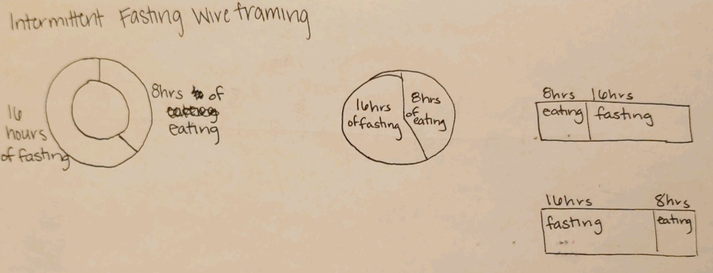

# Assignment 3 & 4: Critique by Design

Source: Atkins.com [The Facts Behind Intermittent Fasting & Keto Diet](https://www.atkins.com/how-it-works/atkins-blogs/colette-heimowitz/the-facts-behind-intermittent-fasting)

I selected this visualization because it's extremely misleading at first glance. The proportions are wonky, and the extra design elements are distracting. If someone was looking into intermittent fasting as a potential lifestyle change, this visualization could mislead them into thinking that they spend more time throughout their day eating than they do fasting. While that doesn't make sense logically, it is what the proportions show, even though that is contrary to the labels. I wanted to see if I could improve this relatively simple visualization to make it easier for readers to interpret at a glance. 

When working on the critique of this image, I tried to have an intellectual response rather than an emotional one. I got so frustrated when I first saw the visualization that I had to take a moment to step back so that I could think critically. Obviously, the most glaring error was that the proportions of the day were misrepresented. In lining up the 8 hours of eating with the clock, the 16 hours of fasting only took up 1/3rd of the circle. I also needed to remove the distraction of the food icons. They didn't add anything to the overall information being portrayed. I also decided that I wanted to change the color scheme to something that people don't have preconceived notions about. The red could be interpreted as fasting being "bad" when it is actually just a choice someone would be making.

I began my wireframing efforts to see if I needed to reimage the type of visualization that was being used or if I could just update the current one. Below, you can see the three types that made it to testing phase. I asked three of my friends what they thought they were looking at, if anything was confusing, who might be interested in this information, and what they would change about the visualization. These questions naturally got them to tell me which of the three options they preferred.

I was interested to hear that all three of them liked the circle chart best because it was reminiscent of a clock. None of them mentioned the fact that this circle portrayed 24 hours instead of 12. The most confusing thing about this for them was the orientation of the parts of the circle. Was I trying to show what part of the day was for eating and what part was for fasting? I think that I would want to make sure that the split was positioned at the bottom so that it looks like eating is positioned in the middle of the trip around the circle, but I couldn't figure out how to adjust the orientation in RawGraphs. 

## The Daily Cycle of Intermittent Fasting 
<svg width="980" height="980" xmlns="http://www.w3.org/2000/svg"><g transform="translate(490, 490)"><g display="none"><path d="M2.1215923377769586e-14,-346.4823227814083A346.4823227814083,346.4823227814083,0,1,1,-2.1215923377769586e-14,346.4823227814083A346.4823227814083,346.4823227814083,0,1,1,2.1215923377769586e-14,-346.4823227814083Z" style="stroke: rgb(255, 255, 255); fill: rgb(90, 180, 172); fill-rule: evenodd;"></path><text transform="translate(1.0607961688884793e-14,173.24116139070415)rotate(90)" text-anchor="middle" dx="6" dy=".35em" style="font-size: 11px; font-family: Arial, Helvetica;"></text><title>undefined: none</title></g><g><path d="M3.0003846579110155e-14,-490A490,490,0,0,1,424.352447854375,244.99999999999991L300.06249349093935,173.2411613907041A346.4823227814083,346.4823227814083,0,0,0,2.1215923377769586e-14,-346.4823227814083Z" style="stroke: rgb(255, 255, 255); fill: rgb(90, 180, 172); fill-rule: evenodd;"></path><text transform="translate(362.2074706726571,-209.1205806953521)rotate(-30.000000000000004)" text-anchor="middle" dx="6" dy=".35em" style="font-size: 17px; font-family: Arial, Helvetica;">8 hours Eating</text><title>Eat: 8</title></g><g><path d="M424.352447854375,244.99999999999991A490,490,0,1,1,-9.001153973733046e-14,-490L-6.364777013330876e-14,-346.4823227814083A346.4823227814083,346.4823227814083,0,1,0,300.06249349093935,173.2411613907041Z" style="stroke: rgb(255, 255, 255); fill: rgb(216, 179, 101); fill-rule: evenodd;"></path><text transform="translate(-362.2074706726571,209.12058069535223)rotate(330)" text-anchor="middle" dx="6" dy=".35em" style="font-size: 17px; font-family: Arial, Helvetica;">16 hours Fasting</text><title>Fast: 16</title></g></g></svg>
 
